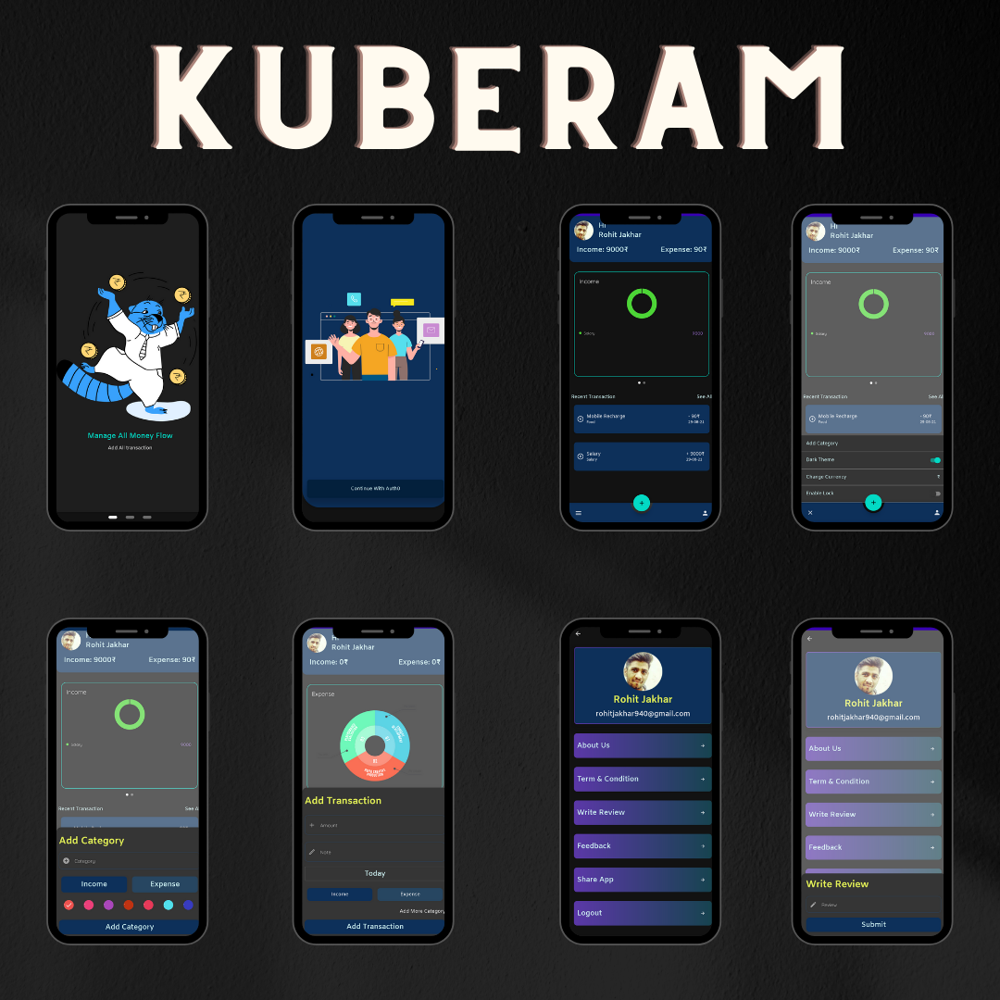
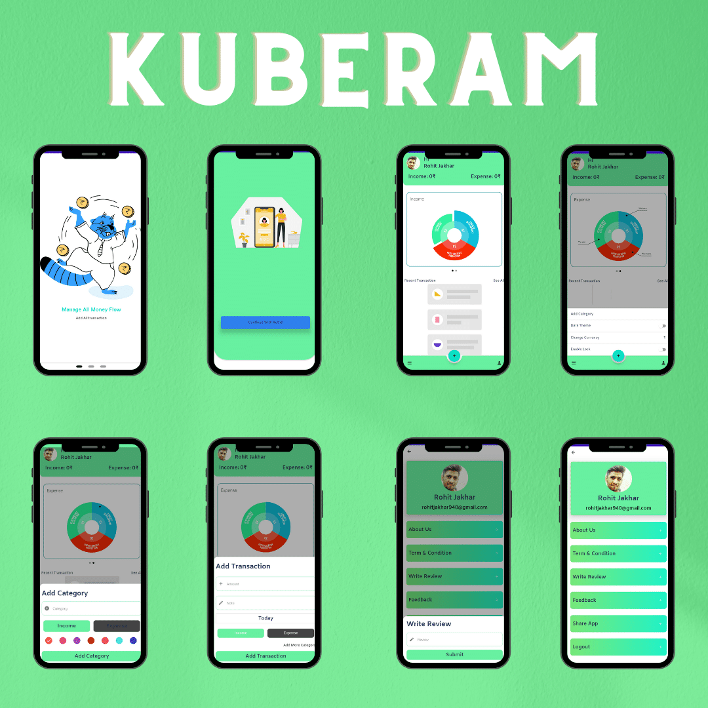
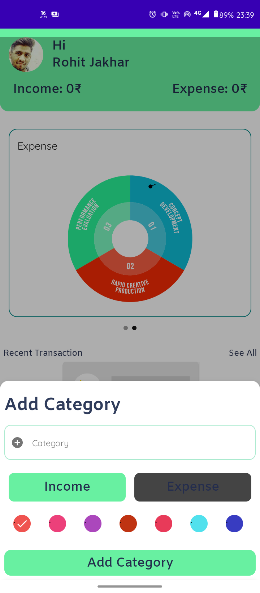
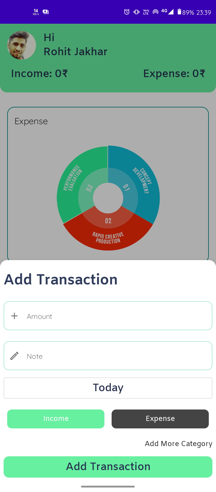
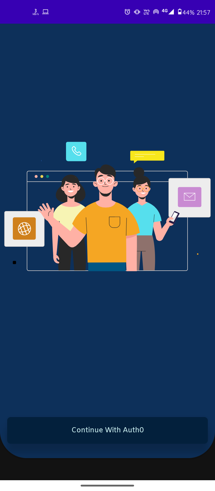
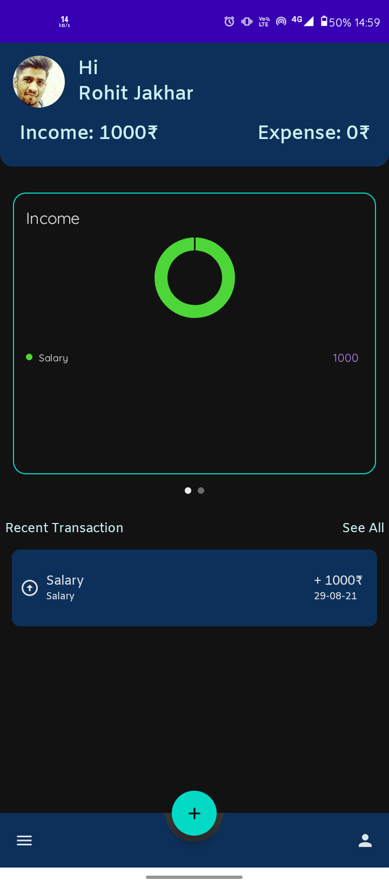
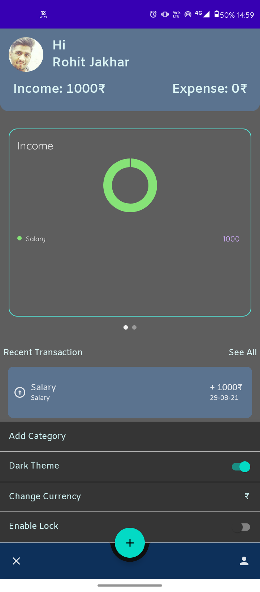
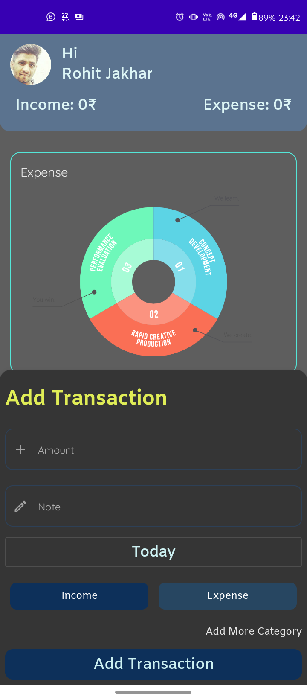
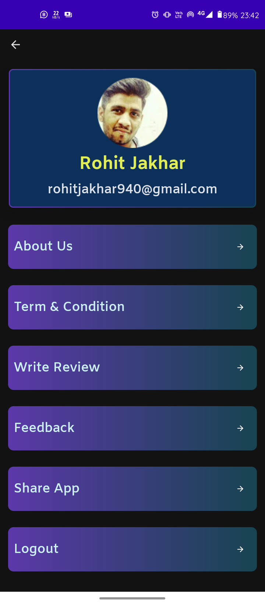
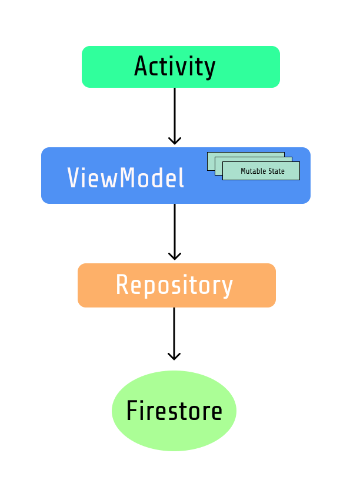

# **Kuberam**

**Kuberam** is an app to manage your transactions.

# Application Install

***You can Install Kuberam app from Play Store 👇***

## Insights into the app 🔎
### Dark Theme

### Light Theme

## Setup
Clone the repository on your machine. Open the project on your IDE and connect it to firebase and Auth0 and everything will be setup

- Instal Android Studio Arctic fox
- Add your firebase json class in app directory
- Change Client id, domain name and scheme in string resources file.

## About

It uses firebase and Auth0 as it's backend. It uses Auth0 Authentication for auth, Firebase Crashlytics for crash reporting and Firestore as its database.

- Fully functionable.
- Clean and Simple Material UI.

## Features:
- **Auth0 Login** :- Auth0 is used for login/signup in app.

- **Biometric Lock** :- For protecting your transaction in app we provide Fingerprint login/Pattern lock.

- **Light & Dark** :- Light and Dark theme is provided in app so both light theme lover and dark theme lover happy.

- **Add Transaction** :- Using simple step you can add your transaction.

pcm
- **Create Category** :- As we know everyone's transaction category so in Kuberam app you can create category as your need.

- **Pie Chart** :- Based on your income and expense transaction we show Pie Chart of Income Transaction and Expense Transaction so your can manage them.

- **Firestore Database** :- Kuberam used Firestore database for saving your all transaction online so you don't worry about backup.

- **Change Currency** :- As we know we are comes from different places and we use different currency for transactions, in Kuberam we provide different type currencies.

- **Delete Transaction** :- If you add transaction by mistakes or you don't want to track that transactions so we provide delete features also. For deleting transaction you need to swipe transaction from Left to End.

- ** In App Review** :- In App Review Library.
- **In App Update** :- In this busy world we always forget about updating app when app have an updates, In Kuberam we use In App Update library so when app have any update it show an popup for update and you can update directly from that without opening playstore.

- **Reminder Notification** :- We send an notification everyday for reminding to add transaction in app so you don't skip any day to add transactions.

## 📸 Screenshots

||||
|:----------------------------------------:|:-----------------------------------------:|:-----------------------------------------: |
|  |  |  |
|   |  |     |
|  |     |       |
|  |  |      |

## Built With 🛠
- [Auth0](https://auth0.com/) -  Auth0 is an easy to implement, adaptable authentication and authorization platform.

- [Jetpack Compose](https://developer.android.com/jetpack/compose) - Jetpack Compose is Android’s modern toolkit for building native UI.

- [Kotlin](https://kotlinlang.org/) - First class and official programming language for Android development.

- [Coroutines](https://kotlinlang.org/docs/reference/coroutines-overview.html) - For asynchronous and more..

- [Flow](https://kotlin.github.io/kotlinx.coroutines/kotlinx-coroutines-core/kotlinx.coroutines.flow/-flow/) - A cold asynchronous data stream that sequentially emits values and completes normally or with an exception.

- [MutableState](https://developer.android.com/jetpack/compose/state) - MutableState is an alternative to using LiveData or Flow . Compose does not observe any changes to this object by default and therefore no recomposition will happen.

- [Android Architecture Components](https://developer.android.com/topic/libraries/architecture) - Collection of libraries that help you design robust, testable, and maintainable apps.

  - [ViewModel](https://developer.android.com/topic/libraries/architecture/viewmodel) - Stores UI-related data that isn't destroyed on UI changes.

  - [DataStore](https://developer.android.com/topic/libraries/architecture/datastore) - Jetpack DataStore is a data storage solution that allows you to store key-value pairs or typed objects with protocol buffers.

- [Dependency Injection](https://developer.android.com/training/dependency-injection) -
  - [Hilt-Dagger](https://dagger.dev/hilt/) - Standard library to incorporate Dagger dependency injection into an Android application.

  - [Hilt-ViewModel](https://developer.android.com/training/dependency-injection/hilt-jetpack) - DI for injecting `ViewModel`.

- [Firebase](https://firebase.google.com)
    - Firebase Firestore - To save data in firebase firestore database
    - Firebase Crashlytics - To report app crashes
    - Firebase Analytics - To report app crashes
    - Firebase Messaging - To send Notifications in app.

- [Material Components for Android](https://github.com/material-components/material-components-android) - Modular and customizable Material Design UI components for Android.

- [Compose Chart](https://github.com/humawork/compose-charts)  - Showing Pie Chart in Jetpack Compose.

-[Coil](https://coil-kt.github.io/coil/compose/) - An image loading library for Android backed by Kotlin Coroutines.

- [Bio-metric Authentication](https://developer.android.com/training/sign-in/biometric-auth) - Authentication using a screen lock credential – the user's PIN, pattern, or password.

- [Accompanist Pager](https://google.github.io/accompanist/pager/) - A library which provides paging layouts for Jetpack Compose.

- [Accompanist Navigation](https://google.github.io/accompanist/navigation-animation/) - A library which provides Compose Animation support for Jetpack Navigation Compose.

- [Lottie](https://github.com/airbnb/lottie-android) - Lottie is a mobile library for Android and iOS that parses Adobe After Effects animations exported as json with Bodymovin and renders them natively on mobile!
# Package Structure

    com.kuberam.android     # Root Package
    .
    ├── Components          # For data handling.
    |
    ├── data
    |   ├── local           # Datastore and its related classes
    |   ├── model           # Firebase, HarperDB and their relative classes
    │   ├── remote          # Model data classes, both remote and local entities
    |
    ├── di                  # Dependency Injection
    │   └── module          # DI Modules
    |
    ├── navigation
    |
    ├── service
    |
    ├── ui
    |   ├── theme           # Manage Themes: Color, Shape, Theme and Type.
    │   ├── view            # All Views: About Screen, All Transaction Screen, Auth Screen, Dashboard Screen, OnBoard Screen, Profile Screen, Splash Screen.
    │   ├── viewmodel       # Viewmodel of app
    |
    |
    └── utils               # Utility Classes: Constant, Interfaces etc.

## Architecture
This app uses [***MVVM (Model View View-Model)***](https://developer.android.com/jetpack/docs/guide#recommended-app-arch) architecture.

## Contribute 🤝

If you want to contribute to this library, you're always welcome!

## Contact 📩

Have an project? DM us at 
Connect with me at LinkedIn 

## Donation 💰

If this project help you reduce time to develop, you can give me a cup of coffee :)

 